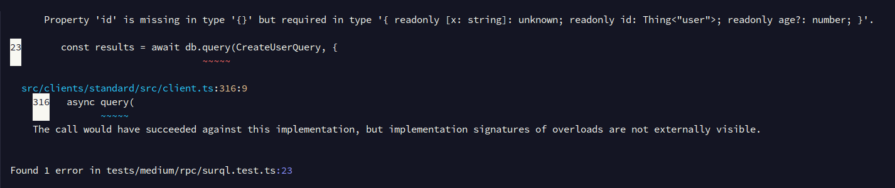

## Basic Usage

A basic example of using prepared queries is as follows:

```typescript
import { surql, Surreal, Thing } from "@tai-kun/surrealdb";

const CreateUserQuery = surql`CREATE ONLY user:foo CONTENT { age: 42 };`
  .returns<[{ id: Thing<"user">, age: number }]>();

const db = new Surreal();
await db.connect(`ws://localhost:8000`);
await db.signin({ user: "root", pass: "root" });
await db.use("example", "example");

const results = await db.query(CreateUserQuery);
//    ^? const results: [{ id: Thing<"user">, age: number }]

await db.disconnect();
```

Preparing queries enables type inference. However, the inferred type needs to be manually specified.


## Validating Query Results

Passing a query result validator to the `.returns` argument makes the query safer.  The following example uses zod to verify that the query result is the expected value:

```typescript
import { surql, Surreal, Thing } from "@tai-kun/surrealdb";
import { z } from "zod";

const isUserTable = (id: Thing): id is Thing<"user"> => id.tb === "user";

const CreatedUserSchema = z.tuple([
  z.object({
    id: z.instanceof(Thing).refine(isUserTable),
    age: z.number(),
  }),
]);

const CreateUserQuery = surql`CREATE ONLY user:bar CONTENT { age: 42 };`
  .returns(CreatedUserSchema.parse.bind(CreatedUserSchema));

const db = new Surreal();
await db.connect(`ws://localhost:8000`);
await db.signin({ user: "root", pass: "root" });
await db.use("example", "example");

const results = await db.query(CreateUserQuery);
//    ^? const results: [{ id: Thing<"user">, age: number }]

await db.disconnect();
```

Note that this example uses Zod, but you are not limited to it.  You can use other validation libraries or custom functions to validate the response.


## Embedding Variables in Queries

`surql` allows you to write queries using template literals, enabling visual embedding of values:

```typescript
import { surql, Surreal, Thing } from "@tai-kun/surrealdb";

const USERNAME = "baz";
const USER_AGE = 42;

const CreateUserQuery = surql`
  CREATE ONLY type::thing('user', ${USERNAME}) CONTENT { age: ${USER_AGE} };`
  .returns<[{ id: Thing<"user">; age: number }]>();

const db = new Surreal();
await db.connect(`ws://localhost:8000`);
await db.signin({ user: "root", pass: "root" });
await db.use("example", "example");

const results = await db.query(CreateUserQuery);
//    ^? const results: [{ id: Thing<"user">, age: number }]

await db.disconnect();
```

The parameters of the RPC request sent in the above example are as follows:

```text
CREATE ONLY type::thing('user', $_jst_0) CONTENT { age: $_jst_1 };
```

```typescript
{
  _jst_0: "baz",
  _jst_1: 42
}
```


## Defining Arguments in Queries

To define arguments for a prepared query, use `surql.slot`:

```typescript
import { surql, Surreal, Thing } from "@tai-kun/surrealdb";
import { z } from "zod";

const isUserTable = (id: Thing): id is Thing<"user"> => id.tb === "user";

const UserIdSchema = z.instanceof(Thing).refine(isUserTable);

const UserIdSlot = surql.slot("id")
  .type(UserIdSchema.parse.bind(UserIdSchema));

const UserAgeSlot = surql.slot("age", 42);

const CreateUserQuery = surql`
  CREATE ONLY ${UserIdSlot} CONTENT { age: ${UserAgeSlot} };`
  .returns<[{ id: Thing<"user">; age: number }]>();

const db = new Surreal();
await db.connect(`ws://localhost:8000`);
await db.signin({ user: "root", pass: "root" });
await db.use("example", "example");

const results = await db.query(CreateUserQuery, {
  id: new Thing("user", "tai-kun"),
});

await db.disconnect();
```

Slots require a variable name. The `.type()` method allows you to add type-level constraints to the variable. Similar to `.returns()`, you can pass a validation function to the `.type()` argument. In the example above, the slot with the variable name `id` must be a record ID with the table name `"user"`.

A default value can be set after the variable name in the slot's argument. If the slot's variable name is omitted at runtime, this default value will be used. In the example above, the slot with the variable name `age` has a default value of `42`.

In addition to `.type()`, slots can also use `.rename()`, `.default()`, `.optional()`, and `.required()`.

If a prepared query contains a slot that requires a variable to be specified at runtime, and that variable is unspecified, the query will be rejected at runtime with a `SurrealTypeError`.  If correctly type-hinted in TypeScript, an error will be shown at compile time without even running the code. For example, omitting a required variable and performing a type check with `tsc` will result in an error as shown below:

```typescript
import { surql, Surreal, Thing } from "@tai-kun/surrealdb";

const UserIdSlot = surql.slot("id")
  .type<Thing<"user">>();

const UserAgeSlot = surql.slot("age", 42);

const CreateUserQuery = surql`
  CREATE ONLY ${UserIdSlot} CONTENT { age: ${UserAgeSlot} };`
  .returns<[{ id: Thing<"user">, age: number }]>()

const db = new Surreal();
await db.connect("ws://localhost:8000");

const results = await db.query(CreateUserQuery, {
  // id: new Thing("user", "tai-kun"),
});

await db.disconnect();
```

`npx tsc --noEmit`:


