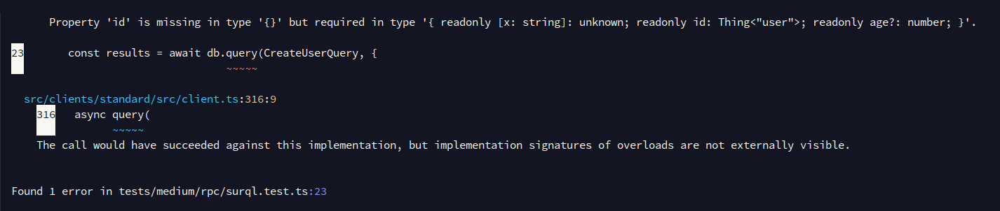

## 기본 사용법

미리 준비된 쿼리를 사용하는 기본적인 예는 다음과 같습니다.

```ts
import { surql, Surreal, Thing } from "@tai-kun/surrealdb";

const CreateUserQuery = surql`CREATE ONLY user:foo CONTENT { age: 42 };`
  .as<[{ id: Thing<"user">, age: number }]>();

const db = new Surreal();
await db.connect(`ws://localhost:8000`);
await db.signin({ user: "root", pass: "root" });
await db.use("example", "example");

const results = await db.query(CreateUserQuery);
//    ^? const results: [{ id: Thing<"user">, age: number }]

await db.close();
```

쿼리를 미리 준비하면 타입 추론이 유효해집니다. 하지만 추론되는 타입은 수동으로 설정해야 합니다.

## 쿼리 결과를 검증하기

`.as` 의 인수에 쿼리 결과의 검증기를 전달하면 쿼리는 더 안전해집니다. 다음 예에서는 zod를 사용하여 쿼리 결과가 의도한 값인지 검증합니다.

```ts
import { surql, Surreal, Thing } from "@tai-kun/surrealdb";
import { z } from "zod";

const isUserTable = (id: Thing): id is Thing<"user"> => id.tb === "user";

const CreatedUserSchema = z.tuple([
  z.object({
    id: z.instanceof(Thing).refine(isUserTable),
    age: z.number(),
  }),
]);

const CreateUserQuery = surql`CREATE ONLY user:bar CONTENT { age: 42 };`
  .as(CreatedUserSchema.parse.bind(CreatedUserSchema));

const db = new Surreal();
await db.connect(`ws://localhost:8000`);
await db.signin({ user: "root", pass: "root" });
await db.use("example", "example");

const results = await db.query(CreateUserQuery);
//    ^? const results: [{ id: Thing<"user">, age: number }]

await db.close();
```

zod에 의존하지 않으므로, valibot 또는 범용적인 함수로 응답을 검증할 수 있습니다.

## 쿼리에 변수를 삽입하기

`surql`은 템플릿 문자열로 쿼리를 작성할 수 있으므로, 값을 시각적으로 삽입할 수 있습니다.

```ts
import { surql, Surreal, Thing } from "@tai-kun/surrealdb";

const USERNAME = "baz";
const USER_AGE = 42;

const CreateUserQuery = surql`
  CREATE ONLY type::thing('user', ${USERNAME}) CONTENT { age: ${USER_AGE} };`
  .as<[{ id: Thing<"user">; age: number }]>();

const db = new Surreal();
await db.connect(`ws://localhost:8000`);
await db.signin({ user: "root", pass: "root" });
await db.use("example", "example");

const results = await db.query(CreateUserQuery);
//    ^? const results: [{ id: Thing<"user">, age: number }]

await db.close();
```

위의 예에서 전송되는 RPC 요청의 매개 변수는 다음과 같습니다.

```text
CREATE ONLY type::thing('user', $_jst_0) CONTENT { age: $_jst_1 };
```

```ts
{
  _jst_0: "baz",
  _jst_1: 42
}
```

## 쿼리에 인수를 정의하기

미리 정의된 쿼리에 인수를 정의하려면 `surql.slot`을 사용합니다.

```ts
import { surql, Surreal, Thing } from "@tai-kun/surrealdb";
import { z } from "zod";

const isUserTable = (id: Thing): id is Thing<"user"> => id.tb === "user";

const UserIdSchema = z.instanceof(Thing).refine(isUserTable);

const UserIdSlot = surql.slot("id")
  .as(UserIdSchema.parse.bind(UserIdSchema));

const UserAgeSlot = surql.slot("age", 42);

const CreateUserQuery = surql`
  CREATE ONLY ${UserIdSlot} CONTENT { age: ${UserAgeSlot} };`
  .as<[{ id: Thing<"user">; age: number }]>();

const db = new Surreal();
await db.connect(`ws://localhost:8000`);
await db.signin({ user: "root", pass: "root" });
await db.use("example", "example");

const results = await db.query(CreateUserQuery, {
  id: new Thing("user", "tai-kun"),
});

await db.close();
```

슬롯에는 반드시 변수 이름이 필요합니다. `.as()` 메서드로 변수에 타입 레벨로 제약을 걸 수 있습니다. `.as()`와 마찬가지로, `.as()`의 인수에 값을 검증하는 함수를 전달할 수 있습니다. 위의 예에서는, 변수 이름 `id`의 슬롯은 테이블 이름이 `"user"`인 레코드 ID여야 합니다.

슬롯의 인수에는 변수 이름 뒤에 기본값을 설정할 수 있습니다. 실행 시 슬롯의 변수 이름이 생략된 경우, 이 기본값이 사용됩니다. 위의 예에서는, 변수 이름 `age`의 슬롯에는 기본값 `42`가 설정되어 있습니다.

슬롯은 `.as()` 외에도 `.rename()`과 `.default()` 및 `.optional()` 및 `.required()`가 있습니다.

미리 정의된 쿼리에, 실행 시 변수의 지정이 필수인 슬롯이 포함된 경우, 그것이 지정되지 않으면 쿼리는 실행 시 `SurrealTypeError`로 거부됩니다. TypeScript에서 제대로 타입 추론되면, 실행하지 않아도 타입 레벨에서 오류가 표시됩니다. 예를 들어, 다음과 같이 필수 변수를 생략하고 `tsc`로 타입 체크를 하면 오류가 됩니다.

```ts
import { surql, Surreal, Thing } from "@tai-kun/surrealdb";

const UserIdSlot = surql.slot("id").as<Thing<"user">>();

const UserAgeSlot = surql.slot("age", 42);

const CreateUserQuery = surql`
  CREATE ONLY ${UserIdSlot} CONTENT { age: ${UserAgeSlot} };`
  .as<[{ id: Thing<"user">, age: number }]>()

const db = new Surreal();
await db.connect("ws://localhost:8000");

const results = await db.query(CreateUserQuery, {
  // id: new Thing("user", "tai-kun"),
});

await db.close();
```

`npx tsc --noEmit`:


