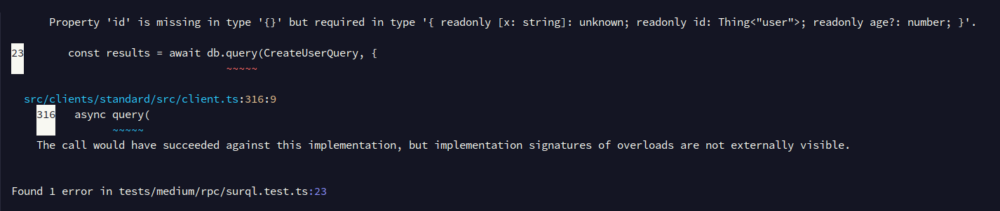

## 基本用法

使用预准备查询的基本示例如下：

```typescript
import { surql, Surreal, Thing } from "@tai-kun/surrealdb";

const CreateUserQuery = surql`CREATE ONLY user:foo CONTENT { age: 42 };`
  .as<[{ id: Thing<"user">, age: number }]>();

const db = new Surreal();
await db.connect(`ws://localhost:8000`);
await db.signin({ user: "root", pass: "root" });
await db.use("example", "example");

const results = await db.query(CreateUserQuery);
//    ^? const results: [{ id: Thing<"user">, age: number }]

await db.close();
```

预准备查询可以启用类型推断。但是，推断的类型需要手动设置。


## 验证查询结果

通过向 `.as` 的参数传递查询结果验证器，可以使查询更安全。在下面的示例中，我们使用 zod 来验证查询结果是否符合预期值：

```typescript
import { surql, Surreal, Thing } from "@tai-kun/surrealdb";
import { z } from "zod";

const isUserTable = (id: Thing): id is Thing<"user"> => id.tb === "user";

const CreatedUserSchema = z.tuple([
  z.object({
    id: z.instanceof(Thing).refine(isUserTable),
    age: z.number(),
  }),
]);

const CreateUserQuery = surql`CREATE ONLY user:bar CONTENT { age: 42 };`
  .as(CreatedUserSchema.parse.bind(CreatedUserSchema));

const db = new Surreal();
await db.connect(`ws://localhost:8000`);
await db.signin({ user: "root", pass: "root" });
await db.use("example", "example");

const results = await db.query(CreateUserQuery);
//    ^? const results: [{ id: Thing<"user">, age: number }]

await db.close();
```

我们并不依赖于 zod，您可以使用 valibot 或通用函数来验证响应。


## 嵌入变量到查询中

`surql` 允许使用模板字符串编写查询，因此可以直观地嵌入值：

```typescript
import { surql, Surreal, Thing } from "@tai-kun/surrealdb";

const USERNAME = "baz";
const USER_AGE = 42;

const CreateUserQuery = surql`
  CREATE ONLY type::thing('user', ${USERNAME}) CONTENT { age: ${USER_AGE} };`
  .as<[{ id: Thing<"user">; age: number }]>();

const db = new Surreal();
await db.connect(`ws://localhost:8000`);
await db.signin({ user: "root", pass: "root" });
await db.use("example", "example");

const results = await db.query(CreateUserQuery);
//    ^? const results: [{ id: Thing<"user">, age: number }]

await db.close();
```

上述示例中发送的 RPC 请求参数如下：

```text
CREATE ONLY type::thing('user', $_jst_0) CONTENT { age: $_jst_1 };
```

```typescript
{
  _jst_0: "baz",
  _jst_1: 42
}
```


## 定义查询参数

要为预准备的查询定义参数，请使用 `surql.slot`：

```typescript
import { surql, Surreal, Thing } from "@tai-kun/surrealdb";
import { z } from "zod";

const isUserTable = (id: Thing): id is Thing<"user"> => id.tb === "user";

const UserIdSchema = z.instanceof(Thing).refine(isUserTable);

const UserIdSlot = surql.slot("id")
  .as(UserIdSchema.parse.bind(UserIdSchema));

const UserAgeSlot = surql.slot("age", 42);

const CreateUserQuery = surql`
  CREATE ONLY ${UserIdSlot} CONTENT { age: ${UserAgeSlot} };`
  .as<[{ id: Thing<"user">; age: number }]>();

const db = new Surreal();
await db.connect(`ws://localhost:8000`);
await db.signin({ user: "root", pass: "root" });
await db.use("example", "example");

const results = await db.query(CreateUserQuery, {
  id: new Thing("user", "tai-kun"),
});

await db.close();
```

插槽必须具有变量名。可以使用 `.as()` 方法在类型级别上约束变量。与 `.as()` 类似，可以将验证值的函数作为 `.as()` 的参数传递。在上面的示例中，变量名为 `id` 的插槽必须是表名为 `"user"` 的记录 ID。

插槽的参数可以跟随变量名设置默认值。如果在运行时省略了插槽的变量名，则将使用此默认值。在上面的示例中，变量名为 `age` 的插槽的默认值为 `42`。

除了 `.as()` 之外，还可以使用 `.rename()`、`.default()`、`.optional()` 和 `.required()`。

如果预准备的查询包含在运行时必须指定变量的插槽，并且未指定该变量，则查询将在运行时被 `SurrealTypeError` 拒绝。如果 TypeScript 类型推断正确，则无需运行即可在类型级别显示错误。例如，如果省略必需的变量并使用 `tsc` 进行类型检查，则会出现错误：

```typescript
import { surql, Surreal, Thing } from "@tai-kun/surrealdb";

const UserIdSlot = surql.slot("id").as<Thing<"user">>();

const UserAgeSlot = surql.slot("age", 42);

const CreateUserQuery = surql`
  CREATE ONLY ${UserIdSlot} CONTENT { age: ${UserAgeSlot} };`
  .as<[{ id: Thing<"user">, age: number }]>()

const db = new Surreal();
await db.connect("ws://localhost:8000");

const results = await db.query(CreateUserQuery, {
  // id: new Thing("user", "tai-kun"),
});

await db.close();
```

`npx tsc --noEmit`:


